# Interview Prep Kit Generator — Trao AI

## Project Overview

An automated **Interview Preparation Kit** generator. The user provides a **Job Description** and a **Company URL**, and the system produces a comprehensive study guide containing:
- A **Company Brief** (scraped & AI-generated)
- Targeted **Interview Questions** mapped to job requirements
- **Flashcards** for rapid study
- A prioritised **Day-by-Day Schedule**

---

## Tech Stack
| Layer | Technology | Purpose |
|---|---|---|
| Frontend | Next.js 14, React, Tailwind CSS | App Router, SSR, dark-navy UI |
| UI Libraries | `@dnd-kit`, `lucide-react`, `@splinetool/react-spline` | Drag-and-drop, icons, 3D assets |
| Backend | Node.js, Express 5 | REST API, SSE streaming, session auth |
| Database | MongoDB (Mongoose 9) | Kits, Users, Jobs, PracticeProgress |
| Sessions | `express-session` + `connect-mongo` | Persistent cookie-based auth |
| LLM | Google Gemini SDK (`gemini-3.1-flash-lite`) | Requirement extraction, Q&A generation |
| Scraping | `undici` + `cheerio` + `robots-parser` | Company page crawling, SSRF-safe |
| Validation | `zod` + `zod-to-json-schema` | Runtime schema enforcement |

---

## High-Level Architecture (HLD)

### 1. System Overview — Full Stack Architecture

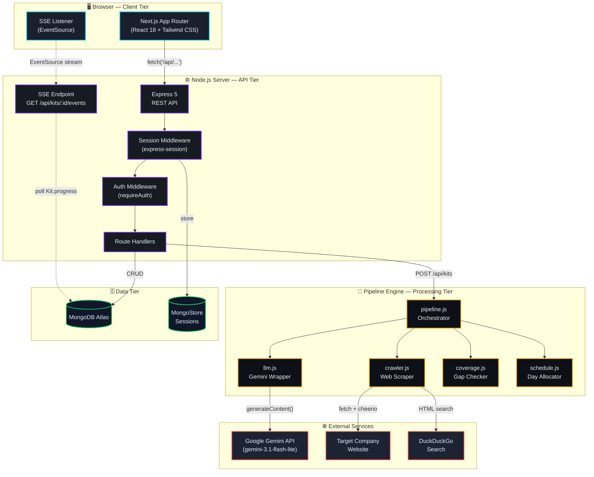

---

### 2. Frontend — Page & Component Architecture

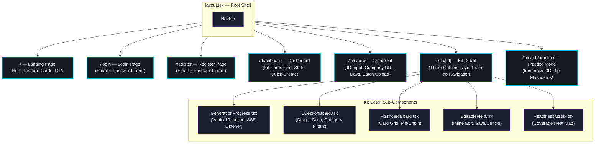

---

### 3. Backend — Module Architecture

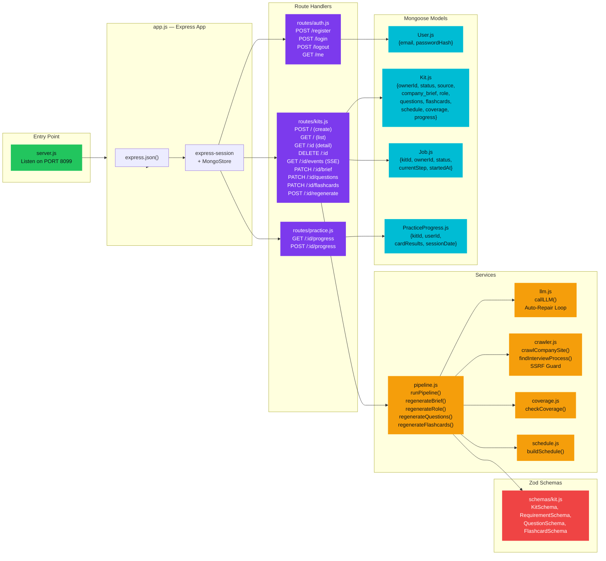

---

### 4. Data Model — Entity Relationship Diagram

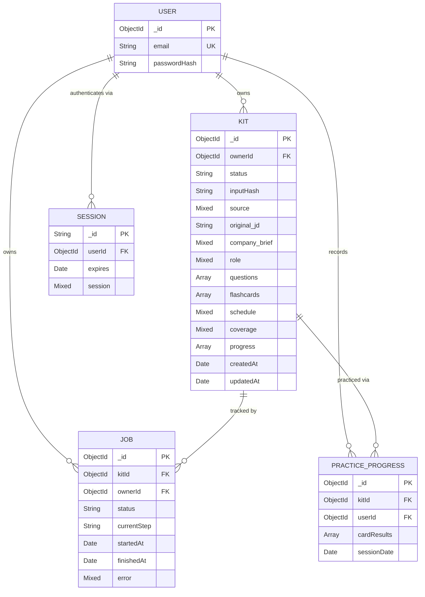

---

### 5. Core Pipeline — Kit Generation Flow (Step-by-Step)

```mermaid
flowchart TD
    START(["🚀 User Submits JD + Company URL + Days"])
    START --> DEDUP{"Duplicate Check<br/>(SHA-256 inputHash)"}
    DEDUP -- "Exists" --> RETURN_EXISTING["Return Existing Kit ID"]
    DEDUP -- "New" --> CREATE_KIT["Create Kit (status: pending)<br/>Create Job (status: running)"]

    CREATE_KIT --> BG_START["🔄 Background Pipeline Starts"]

    BG_START --> STEP1["Step 1: extractRequirements<br/>───────────────────<br/>LLM analyses JD text<br/>→ title, seniority, location<br/>→ requirements (must / nice-to-have)"]

    STEP1 --> STEP2["Step 2: crawlCompanySite<br/>───────────────────<br/>Fetch company URL<br/>→ Discover subpage links<br/>→ Check robots.txt<br/>→ LLM ranks relevant pages<br/>→ Scrape top 3 pages"]

    STEP2 --> STEP3["Step 3: buildCompanyBrief<br/>───────────────────<br/>LLM summarises scraped pages<br/>→ summary, what_they_do, sources"]

    STEP3 --> STEP4["Step 4: findInterviewProcessDiscussion<br/>───────────────────<br/>DuckDuckGo search:<br/>Company interview process questions<br/>→ Parse search snippets<br/>→ Extract interview context"]

    STEP4 --> STEP5["Step 5: generateQuestions<br/>───────────────────<br/>For EACH requirement:<br/>→ LLM generates targeted Q and A<br/>→ 1.5s delay between calls<br/>→ Attach _meta pinned: false"]

    STEP5 --> STEP6{"Step 6: checkCoverage<br/>───────────────────<br/>Diff must-have requirements<br/>vs generated questions"}

    STEP6 -- "Gaps found &<br/>passes < 3" --> GAP_FILL["Generate questions<br/>for uncovered requirements"]
    GAP_FILL --> STEP6

    STEP6 -- "All covered OR<br/>max passes reached" --> STEP7["Step 7: generateFlashcards<br/>───────────────────<br/>LLM creates front/back cards<br/>from question set"]

    STEP7 --> STEP8["Step 8: buildSchedule<br/>───────────────────<br/>Score questions (priority × difficulty)<br/>→ Inject fallbacks for gaps<br/>→ Sort descending by score<br/>→ Distribute across N days"]

    STEP8 --> VALIDATE{"Step 9: Zod Schema<br/>Validation"}
    VALIDATE -- "Pass" --> SAVE["Save Kit (status: ready)<br/>Mark Job (status: completed)"]
    VALIDATE -- "Fail" --> FAIL["Save Kit (status: failed)<br/>Mark Job (status: failed)"]

    SAVE --> DONE(["✅ Kit Ready — SSE notifies client"])
    FAIL --> DONE_FAIL(["❌ Kit Failed — SSE notifies client"])

    classDef start fill:#22c55e,stroke:#22c55e,color:#0d1117
    classDef step fill:#161b22,stroke:#00bcd4,stroke-width:2px,color:#e6edf3
    classDef decision fill:#1a1f2e,stroke:#f59e0b,stroke-width:2px,color:#e6edf3
    classDef success fill:#065f46,stroke:#22c55e,color:#e6edf3
    classDef error fill:#7f1d1d,stroke:#ef4444,color:#e6edf3

    class START,BG_START start
    class STEP1,STEP2,STEP3,STEP4,STEP5,GAP_FILL,STEP7,STEP8,CREATE_KIT step
    class DEDUP,STEP6,VALIDATE decision
    class SAVE,DONE,RETURN_EXISTING success
    class FAIL,DONE_FAIL error
```

---

### 6. LLM Self-Healing — Auto-Repair Loop

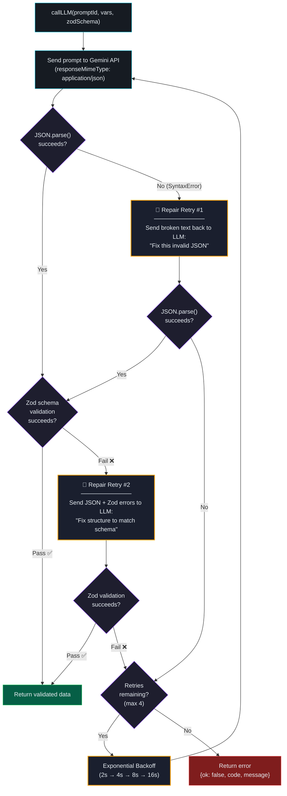

---

### 7. Real-Time Progress — SSE Communication

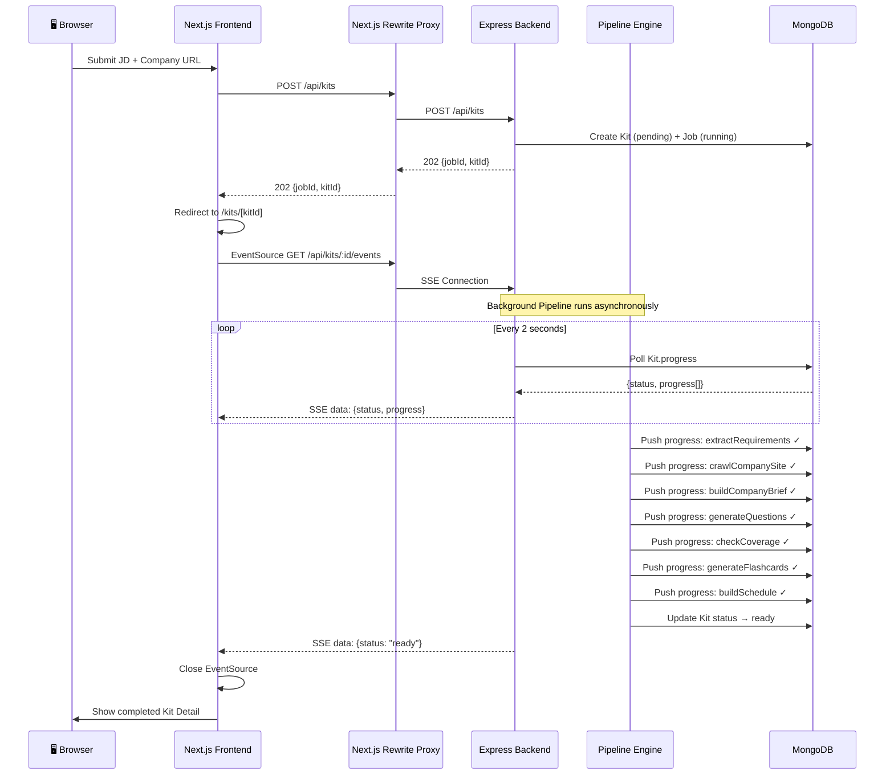

---

### 8. User Edit & Regeneration Flow

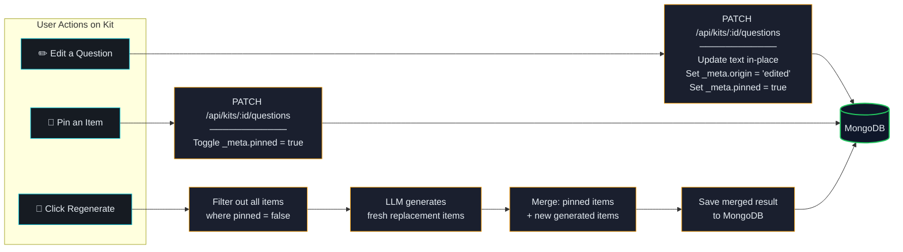

---

### 9. Schedule Allocation Algorithm

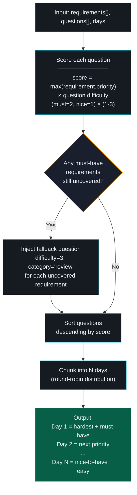

---

### 10. API Routes Map

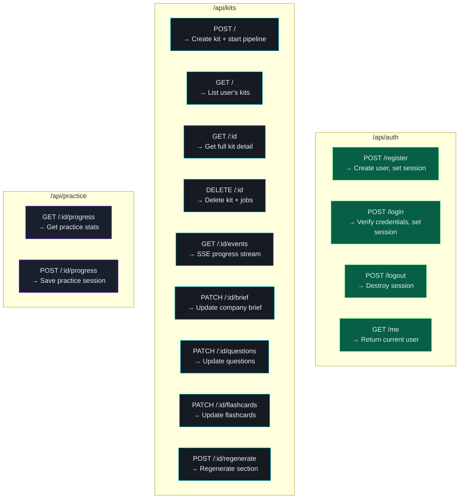

---

### 11. Security Architecture

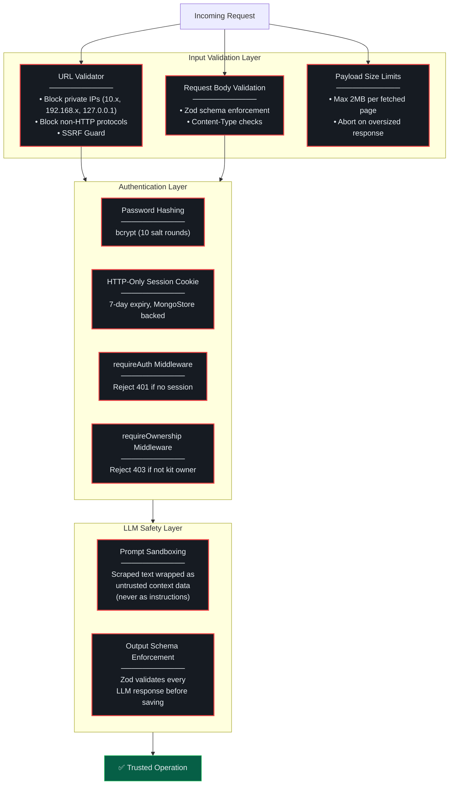

---

## Setup Instructions

### Environment Variables
Create a `.env` file in the `backend` directory based on `.env.example`. You will need:
- `GEMINI_API_KEY`: Your Google Gemini API key.
- `MONGO_URI`: Your MongoDB connection string.

### Local Development
1. **Backend**:
   ```bash
   cd backend
   npm install
   npm start
   ```
2. **Frontend**:
   ```bash
   cd frontend
   npm install
   npm run dev
   ```

### Running the Batch Entry Point
To generate kits in bulk from a JSON file containing cases (array of objects with `id`, `jd`, `company_url`, `days`):
```bash
cd backend
npm run evaluate -- --input cases.json --output kits.json
```

---

## LLM Provider and Model
- **Provider**: Google
- **Model**: `gemini-3.1-flash-lite`. Chosen for its balance of speed and reasoning capabilities, which is crucial when making multiple sequential API calls for requirement extraction, question generation, and flashcard creation.

---

## Key Design Decisions, Trade-offs, and Limitations
- **Sequential LLM Calls over Parallel**: Generating questions per requirement is done sequentially with a 1.5s delay. *Trade-off*: This significantly increases the total generation time, but it was necessary to aggressively prevent `HTTP 429 Too Many Requests` errors from the LLM provider rate limits.
- **Search Snippets over Full Page Fetches**: For the interview process search, the app only parses DuckDuckGo search result snippets rather than fetching the full Reddit/Glassdoor pages. *Trade-off*: It's much faster and avoids complex bot-protection mechanisms on those sites, but the context is limited to ~160 characters per result, sometimes missing deeper insights.
- **SSRF limitations**: The crawler uses a strict URL validator to prevent Server-Side Request Forgery (SSRF) and blocks requests to localhost/private IPs. *Limitation*: This prevents testing the crawler against a local mock server unless `ALLOW_LOCAL_HOSTS=true` is set.
